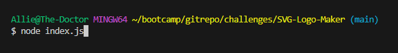
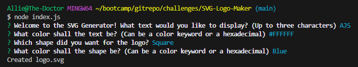
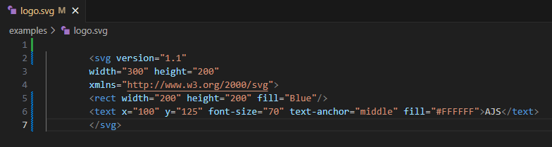

# SVG-Logo-Maker

## Badge
[]
 

## Table of Contents
- [Description](#description)
- [Screenshots](#screenshots)
- [Usage](#usage)
- [What I Have Learned](#what-i-have-learned)
- [Credits](#credits)
- [Licenses](#licenses)
 

## Description
Challenge 10 coursework for UT bootcamp. Uses Node.js.  
This program is designed to create an SVG logo, based on user input.  
Shape, shape color, text, and text color, are all determined when
the user starts the program and gives their responses.  
Colors can be inputted either with a keyword (ex: blue) or a hexadecimal (ex: #FFFFFF).  

## Screenshots
---Starting the program---  
  
---Answering questions, logo created---  
  
---The SVG logo example---  
  
---The SVG output in VSCode---  
  

## Usage
Simply click on the video and watch the magic happen.    
Link to the video: ---  

## What I Have Learned
I have learned a lot about applying object-oriented programming into
the form of this project.  
Having each file derive from one another,
makes for cleaner and more efficient coding practices.  
Utilizing classes and being able to extend the properties of one to
other classes, reduces the amount of code needed to operate.

## Credits
Made by Allie Stewart.  
Many thanks to the docs, such as https://developer.mozilla.org/en-US/docs/Web/SVG  
and https://stackoverflow.com for many questions answered.

## Licenses
Please refer to the LICENSE in the repository.  